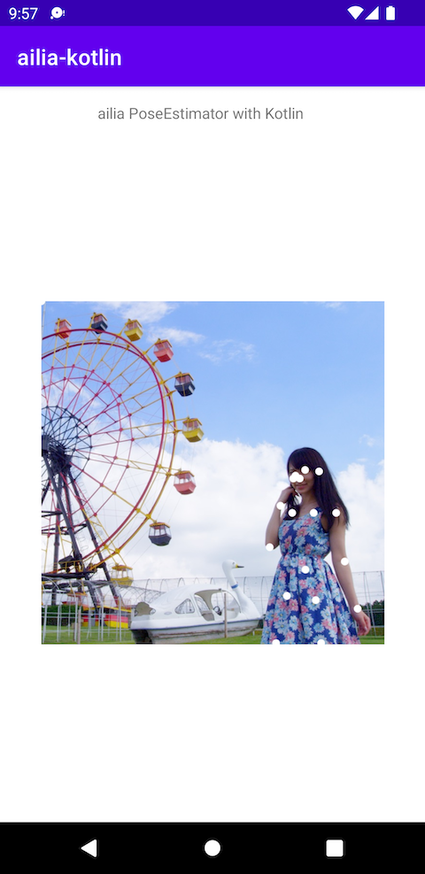

# ailia-android-studio-kotlin

Demo project of ailia SDK with Android Studio (Kotlin)

## Test environment

- macOS 12.1 / Windows 11
- Android Studio 2023.1.1
- Gradle 7.4.2
- ailia SDK 1.5.0

## Setup

Download dependent libraries via submodule.

```
git submodule init
git submodule update
```

## Supported models

### ailia SDK

#### Light Weight Human Pose Estimation

Estimate keypoints of person.

Input


Output



### ailia TFLite Runtime

#### YOLOX

Estimate bounding box of object.

### ailia Tracker

Tracking object using ByteTrack.

### ailia Tokenizer

#### TBD