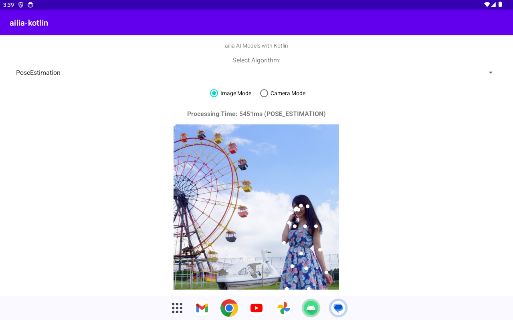

# ailia MODELS Kotlin

Demo project of ailia SDK with Android Studio (Kotlin)

## Test environment

- macOS 12.1 / Windows 11
- Android Studio 2023.1.1
- Gradle 7.4.2
- ailia SDK 1.5.0

## Setup

Download dependent libraries via submodule.

```
git submodule init
git submodule update
```

## Supported models

|Category|Model|SDK|
|-----|-----|-----|
|Pose Estimation|[Light Weight Human Pose Estimation](app/src/main/java/jp/axinc/ailia_kotlin/AiliaPoseEstimatorSample.kt)|ailia SDK (ONNX)|
|Object Detection|[YOLOX](app/src/main/java/jp/axinc/ailia_kotlin/AiliaTFLiteObjectDetectionSample.kt)|ailia TFLite Runtime|
|Object Tracking|[ByteTrack](app/src/main/java/jp/axinc/ailia_kotlin/AiliaTrackerSample.kt)|ailia TFLite Runtime + ailia Tracker|
|Image Classification|[MobileNetV2](app/src/main/java/jp/axinc/ailia_kotlin/AiliaTFLiteClassificationSample.kt)|ailia TFLite Runtime|
|NLP|[GPT2 Tokenizer](app/src/main/java/jp/axinc/ailia_kotlin/AiliaTokenizerSample.kt)|ailia Tokenizer|

## Usage

You can select the model at the top. In the second, you can choose between image or camera.



